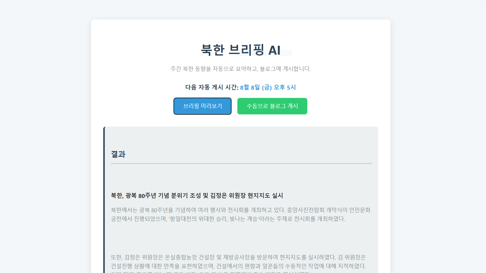

# 북한 브리핑 AI – 일간 북한 동향 자동 요약 블로그 서비스

## 📝 프로젝트 소개

이 프로젝트는 공공데이터 포털의 북한 관련 API를 활용하여 최신 동향 데이터를 자동으로 수집하고, 수집된 데이터를 OpenAI API(GPT-4o-mini, DALL-E 3)로 요약 및 가공하여 다양한 관점의 뉴스 기사를 생성하는 시스템입니다. 생성된 기사는 특정 시간에 맞춰 **티스토리 블로그에 자동으로 게시**됩니다.



---

## 🚀 주요 기능

  * **다양한 데이터 수집**: 통일부에서 제공하는 '북한 동향', '김정은 공개 활동', '통일부 보도자료' 등 3가지 API에서 최신 데이터를 수집합니다.
  * **AI 기반 뉴스 요약**: 수집된 데이터를 바탕으로 12가지 언어(한국어, 영어, 중국어, 일본어 등) 및 12가지 관점(긍정적, 부정적, 미래 예측, 심층 분석 등)의 기사를 생성합니다.
  * **자동 이미지 생성**: 기사 제목을 기반으로 DALL-E 3를 이용해 뉴스에 적합한 이미지를 자동으로 생성합니다. (비용 문제로 인해 일시중지)
  * **티스토리 자동 업로드**: 생성된 기사 제목, 본문(HTML), 이미지 URL을 티스토리 블로그에 자동으로 업로드합니다.
  * **웹 UI 및 API 제공**: FastAPI를 사용하여 웹 기반 대시보드와 REST API를 제공하여 수동으로 기사를 생성하고 게시할 수 있습니다.
  * **주간 스케줄링**: APScheduler를 이용해 매주 일요일, 특정 시간(KST)에 맞춰 각 관점의 기사를 순차적으로 자동 게시합니다.

---

## 🛠 기술 스택

  * **백엔드**: Python, FastAPI
  * **AI 모델**: OpenAI API (GPT-4, DALL-E 3)
  * **데이터 수집**: `requests` 라이브러리
  * **자동화**: `APScheduler`
  * **웹 프레임워크**: Jinja2 Templates (프론트엔드)
  * **배포**: 구름IDE (추후 개인서버로 이전 예정)

---

## 📁 파일 구조

```
.
├── app/
│   ├── blog_uploader.py    # 티스토리 업로드 기능
│   ├── fetcher.py          # 공공데이터 API 데이터 수집 기능
│   ├── summarizer.py       # OpenAI API를 활용한 요약 및 이미지 생성 기능
│   └── main.py             # FastAPI 애플리케이션 및 스케줄링 설정
├── static/
│   ├── templates/
│   │   └── index.html      # 웹 UI 템플릿
│   └── js/
│       └── script.js       # 웹 UI 동작 스크립트
└── .env.example            # 환경 변수 예시
└── README.md
```

---

## 🤖 API 엔드포인트

  * **`GET /`**: 웹 대시보드 페이지를 반환합니다.
  * **`GET /briefing/weekly?language={code}`**: 선택한 언어/관점으로 주간 브리핑을 요약하여 JSON 형태로 반환합니다.
  * **`GET /briefing/publish?language={code}`**: 선택한 언어/관점으로 기사를 생성하고 티스토리 블로그에 게시합니다.

---

## 📅 자동 게시 스케줄

이 프로젝트는 매주 **일요일**에 아래와 같이 각기 다른 관점의 기사를 자동으로 발행하도록 설정되어 있습니다. (시간은 **KST, 대한민국 표준시** 기준)

| 언어 (코드) | 관점             | 게시 시간 (KST) |
| :---------- | :--------------- | :-------------- |
| **ko** | 긍정적 관점      | 21:00           |
| **en** | 부정적 관점      | 23:00           |
| **zh** | 미래 예측        | 01:00           |
| **ja** | 대외 관계        | 03:00           |
| **ru** | 카드 뉴스 형식   | 05:00           |
| **de** | 심층 분석        | 07:00           |
| **fr** | Q\&A 형식         | 09:00           |
| **es** | 인포그래픽 설명  | 11:00           |
| **ar** | 초보자용         | 13:00           |
| **hi** | 전문가용         | 15:00           |
| **vi** | 흥미 위주        | 17:00           |
| **id** | 결론 및 종합     | 19:00           |
